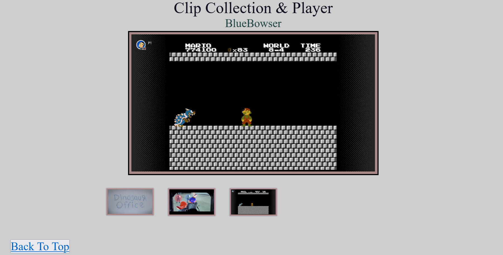

# Video-Player-Grid
This is a website that has a main video player at the top and a grid of selectable videos underneath.

## Requirements

* [Python 3](https://www.python.org/downloads/)
* [ffmpeg](https://ffmpeg.org/download.html)

## To Use

* Drop clips in the ["clip_mp4"](clip_mp4/) folder.
* Run the [*createClipsPaths*](createClipsPaths.py) Python script.

Ensure that the [*index.html*](index.html) and [*callClip.js*](docs/callClip.js) files and the thumbnails folder have write permissions.

The other files in ["docs"](docs/) folder and the video files in ["clip_mp4"](clip_mp4/) folder require at least read permissions.

Ffmpeg will automatically generate thumbnails from videos, but alternatively, provide thumbnails whose names match the names of your clips and end in ".png".

## About the Project Structure

This is meant to be a simple deployment of a website which can read video clips, show their thumbnails and allow playback of one from the collection. No back-end API required, much of the setup is automated via Python, with the webpage running only on minimal HTML, CSS and Javascript.
